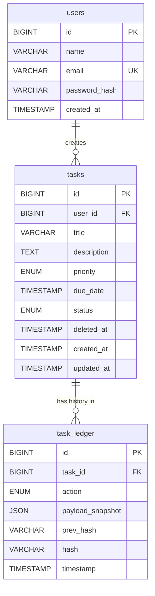

# Entity Relationship Diagram

```mermaid
erDiagram
    users {
        BIGINT id PK
        VARCHAR name
        VARCHAR email UK
        VARCHAR password_hash
        TIMESTAMP created_at
    }

    tasks {
        BIGINT id PK
        BIGINT user_id FK
        VARCHAR title
        TEXT description
        ENUM priority
        TIMESTAMP due_date
        ENUM status
        TIMESTAMP deleted_at
        TIMESTAMP created_at
        TIMESTAMP updated_at
    }

    task_ledger {
        BIGINT id PK
        BIGINT task_id FK
        ENUM action
        JSON payload_snapshot
        VARCHAR prev_hash
        VARCHAR hash
        TIMESTAMP timestamp
    }

    users ||--o{ tasks : "creates"
    tasks ||--o{ task_ledger : "has history in"
```
